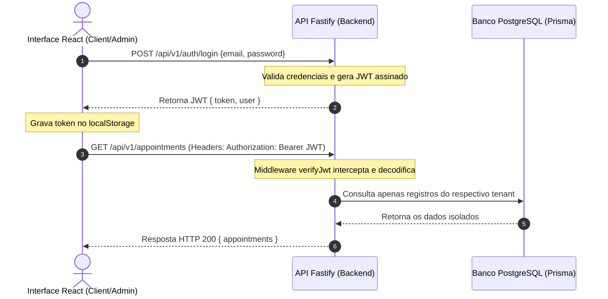

# Como o JWT vai funcionar no SaaS StyleFlow 🔐

O **JSON Web Token (JWT)** é a espinha dorsal de autenticação e identificação de inquilino (tenant) entre o React Frontend e a API Fastify no Backend. Cada requisição autenticada carrega o token na assinatura para garantir isolamento absoluto.

---

## 🔑 A Anatomia do Payload do Token

Quando um usuário realiza o login (`authService.login`), a API backend gera um token assinado criptograficamente com o algoritmo **HS256** utilizando a chave secreta de ambiente `JWT_SECRET`. 

O payload do token carrega dados essenciais de controle estrutural:

```json
{
  "userId": "uuid-do-usuario-logado-no-banco",
  "role": "OWNER | PROFESSIONAL | CUSTOMER | SUPER_ADMIN",
  "iat": 1779289358,
  "exp": 1779375758
}
```

* **userId**: Identificador exclusivo global na tabela `User`. Ele é a chave primária para associar o usuário aos seus respectivos perfis e salões.
* **role**: Cargo operacional do usuário no sistema. Controla o acesso RBAC (Role-Based Access Control) nas rotas privadas.
* **iat (Issued At)**: Data/Hora exata de emissão do token (fuso UTC).
* **exp (Expiration Time)**: Data de validade e expiração do token de segurança.

---

## 🔄 Fluxo de Autenticação e Autorização



1. **Geração do Token**: O token é gerado com exclusividade no serviço de autenticação (`auth.service.ts`) e retornado com o objeto simplificado de usuário.
2. **Armazenamento Seguro**: O frontend grava o token no `localStorage` sob a chave `token`.
3. **Assinatura de Requisições**: O cabeçalho HTTP padrão de autorização `Authorization: Bearer <JWT>` é enviado automaticamente em todos os endpoints privados interceptados pelo hook `verifyJwt`.
4. **Resgate do Contexto**: O middleware decodifica e preenche a propriedade `request.user` com o payload decodificado, tornando os identificadores disponíveis em todas as camadas de serviços e controllers subsequentes.