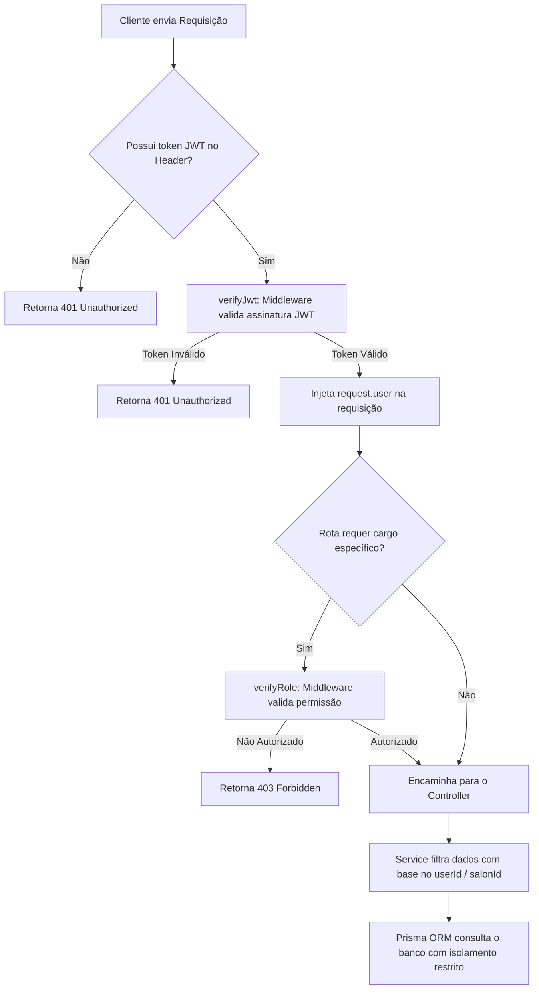

# Middleware de Tenant Isolation no SaaS StyleFlow 🛡️

O **Isolamento de Tenant (Tenant Isolation)** é o coração da segurança da API no SaaS StyleFlow. Ele impede matematicamente que dados de estabelecimentos concorrentes se cruzem ou vazem na camada de dados.

---

## 🔒 Princípio do Isolamento Ativo

Em vez de confiar que o frontend enviará o ID correto do salão nas requisições (o que permitiria a um usuário malicioso trocar o ID na requisição por meio de ferramentas como o Postman e ler dados de terceiros), o backend extrai a identidade do inquilino diretamente a partir do token **JWT assinado**.



---

## 🛠️ Implementação Técnica no Backend

### 1. Middleware de Autenticação (`auth.middleware.ts`)
O hook do Fastify decodifica o cabeçalho Bearer e popula a propriedade `user` no objeto de requisição:

```typescript
import { FastifyRequest, FastifyReply } from 'fastify';
import jwt from 'jsonwebtoken';
import { env } from '../config/env';

export async function verifyJwt(request: FastifyRequest, reply: FastifyReply) {
  try {
    const token = request.headers.authorization!.split(' ')[1];
    request.user = jwt.verify(token, env.JWT_SECRET) as any;
  } catch (e) {
    return reply.status(401).send({ error: 'Token inválido ou ausente.' });
  }
}

export function verifyRole(roles: string[]) {
  return async (request: FastifyRequest, reply: FastifyReply) => {
    if (!roles.includes(request.user!.role)) {
      return reply.status(403).send({ error: 'Acesso negado: cargo insuficiente.' });
    }
  };
}
```

### 2. Isolamento de Consultas na Camada de Serviço (`establishment.service.ts`)
Toda consulta a dados sensíveis (Agendamentos, Financeiro, Clientes, Equipe, Configurações) passa obrigatoriamente por uma verificação rigorosa de posse ou escopo do inquilino. 

Exemplo de serviço validando a posse de salão:

```typescript
async getById(id: string, userId: string, role: string) {
  const salon = await prisma.salon.findUnique({
    where: { id },
    include: { owner: true }
  });

  if (!salon) throw new Error('NOT_FOUND');

  // Isolamento Rígido: Apenas o dono do salão ou Super Administradores podem ler/editar
  if (role !== 'SUPER_ADMIN' && salon.ownerId !== userId) {
    throw new Error('FORBIDDEN');
  }

  return salon;
}
```

---

## 🧬 Benefícios da Solução
1. **Zero Confiança no Cliente**: Toda e qualquer informação de contexto é extraída a partir de tokens criptografados e validados pelo backend.
2. **Defesa em Profundidade**: Isolamento garantido no JWT, validado na rota via hooks e imposto nas queries SQL executadas pelo Prisma.
3. **Logs Seguros**: Como a identidade do usuário é persistida no hook, os logs de auditoria LGPD (`LgpdLog`) registram com integridade forense quem realizou cada operação.